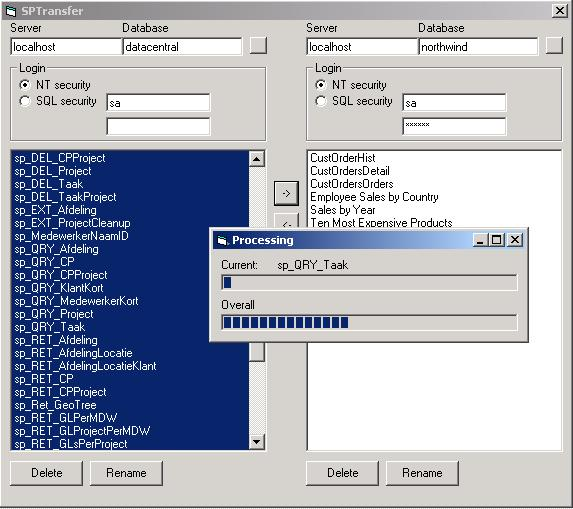



## SP Manager

### Description

This copies, renames or deletes stored procedures on an SQL server. Also the ability to copy procedures cross database, or even cross server. This thingy is way easier and faster then the import/export wizard.
 
### More Info
 

             |
---                |---
**Submitted On**   |2001-03-29 15:41:36
**By**             |[Networking\.be](https://github.com/Planet-Source-Code/PSCIndex/blob/master/ByAuthor/networking-be.md)
**Level**          |Intermediate
**User Rating**    |4.3 (17 globes from 4 users)
**Compatibility**  |VB 5\.0, VB 6\.0
**Category**       |[Databases/ Data Access/ DAO/ ADO](https://github.com/Planet-Source-Code/PSCIndex/blob/master/ByCategory/databases-data-access-dao-ado__1-6.md)
**World**          |[Visual Basic](https://github.com/Planet-Source-Code/PSCIndex/blob/master/ByWorld/visual-basic.md)
**Archive File**   |[CODE\_UPLOAD176863292001\.zip](https://github.com/Planet-Source-Code/networking-be-sp-manager__1-22006/archive/master.zip)

